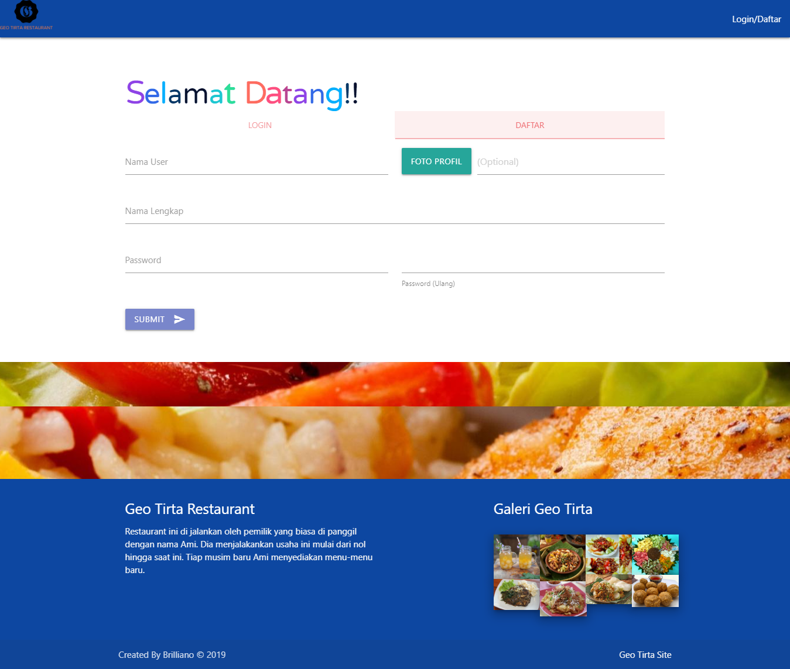

# GEO TIRTA RESTAURANT ☕️


> This project is created by using PHP and MySQL

## To run this project locally
* Clone this repo
* Import this [restoran.sql](akses/restoran.sql) to your Database
* Move this file to htdocs inside xampp folder
  ```diff
  ! if you're use local XAMPP
  ```
* Run [index.php](project/Restoran/index.php) on your browser NB: For User
* Run [index-admin.php](project/Restoran/index-admin.php) NB: For Admin

## The ideas behind this project 

This project is made for my last project on my school Vacational Highschool [SMKN 2 Trenggalek](https://smkn2trenggalek.sch.id/). This project base on PHP and MYSQL, but for boostraping i'm using [Materialize](https://materializecss.com/). I made this project is inspirated by my mom Juice Shop at [Geo Tirta Juice](https://geo-tirta-juice.business.site/) i've inspirated because my mom have dream to make it real Geo Tirta Restaurant.

## Screenshot

```diff
! user page
```

<kbd>

</kbd>
<kbd>

</kbd>
<kbd>

</kbd>

```diff
! admin page
```
<kbd>

</kbd>
<kbd>

</kbd>
<kbd>

</kbd>